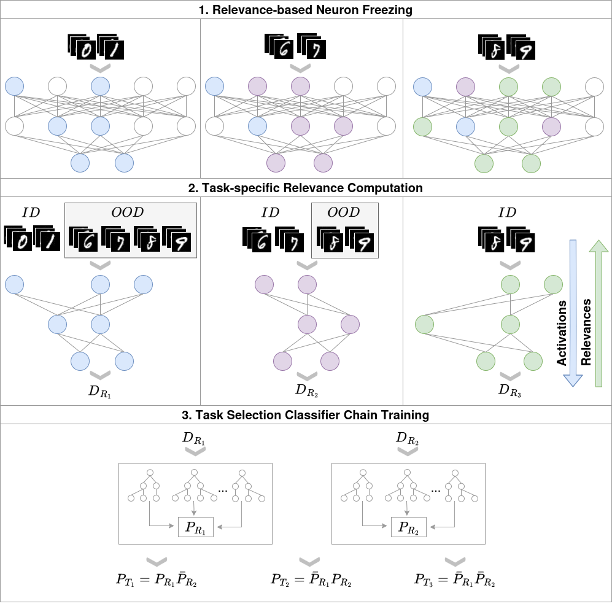

<div align="center">

# ReReLRP - Remembering and Recognizing Tasks with LRP


<div align="left">

This is the implementation of the paper:  
_**ReReLRP - Remembering and Recognizing Tasks with LRP**_  
*Karolina Bogacka, Maximilian Höfler, Maria Ganzha, Wojciech Samek, Katarzyna Wasielewska-Michniewska*  
 ([arxiv](https://arxiv.org/abs/2010.15277))
The implementation includes the code necessary to recreate benchmarks and method implementations used in the paper, as well as notebooks used for result plotting. The code in the repositories is based on the excellent [FACIL](https://github.com/mmasana/FACIL) and [LifeLonger](https://github.com/mmderakhshani/LifeLonger) frameworks,  as well as prior works on [LRP pruning](https://github.com/seulkiyeom/LRP_pruning) and [implementations of neuron freezing](https://github.com/galidor/PyTorchPartialLayerFreezing/blob/main/partial_freezing.py)  (licenses in relevant directories).

## How To Use
Clone this github repository:
```
git clone https://github.com/Karolina-Bogacka/ReReLRP.git
cd FACIL
```


  The library requirements of the code are detailed in [requirements.txt](requirements.txt). You can install them
  using pip with:
  ```
  python3 -m pip install -r requirements.txt
  ```


To run the basic code:
```
python3 -u src/main_incremental.py
```
Make sure that the approach you select is compatible with the benchmark you would like to run.

### Scripts
We provide sample scripts used to reproduce the specific scenarios presented in the paper.
Check out all available in the [scripts](scripts) folder.

### Plotting
We include notebooks used to create the plots presented in the paper.

## License
Please check the CC-BY-NC-SA license that is listed in this repository.

## Cite
If you want to cite the paper feel free to use this preprint citation while we await publication:
```bibtex
@article{masana2022class,
  title={Class-Incremental Learning: Survey and Performance Evaluation on Image Classification},
  author={Masana, Marc and Liu, Xialei and Twardowski, Bartłomiej and Menta, Mikel and Bagdanov, Andrew D. and van de Weijer, Joost},
  journal={IEEE Transactions on Pattern Analysis and Machine Intelligence},
  doi={10.1109/TPAMI.2022.3213473},
  year={2023},
  volume={45},
  number={5},
  pages={5513-5533}}
}
```

---
